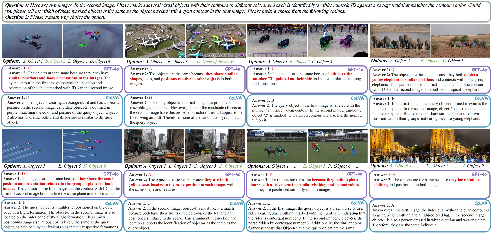

# Are They the Same? Exploring Visual Correspondence Shortcomings of Multimodal LLMs

### [Paper](https://arxiv.org/abs/***) | [Project Page](https://zhouyiks.github.io/***) | [MMVM Benchmark](https://huggingface.co/zhouyik/MMVMBench) | [Huggingface](https://huggingface.co/zhouyik/colva_internvl2_4b)




## Contents:
1. [Getting Started](#start)
2. [Benchmark](#benchmarks)
3. [Evaluation](#evaluation)
4. [Training](#training)
5. [License](#license)
6. [Citation](#citation)
7. [Acknowledgement](#acknowledgement)

## Getting Started <a name="start"></a>

### Environment Requirements
```
# python recommendation
conda create --name colva-env python=3.10 -y
conda activate colva-env

# transformers requirements
# When using InternVL2 as the base model, transformers>=4.37.2 works normally.
# When using Qwen2VL as the base model, we recommend installing the latest version of transformers:
pip install git+https://github.com/huggingface/transformers

# xtuner requirements
pip install -U 'xtuner[deepspeed]'
```

### Pre-trained Model

The CoLVA Models (Based on InternVL2 4b) can be found [here](https://huggingface.co/zhouyik/colva_internvl2_4b).


## Benchmarks <a name="benchmark"></a>

### MMVM Benchmark

Our MMVM Benchmark is available [here](https://huggingface.co/zhouyik/MMVMBench). It is specially crafted to measure **multimodal LLM's** 
visual matching ability via VQA. The benchmark is seperated into a folder containing 1510 cases and a tsv file. Each of these case folders contains
the images and visual prompt annotation file involved in the corresponding conversation. The tsv file contains questions, options, and answers.
```
├── match_bench
|   |── case_xxx
|   |   |── FRAME00.jpg
|   |   |── FRAME00_ORI.jpg
|   |   |── FRAME00.json
|   |   |── FRAME01_CAND.jpg
|   |   |── FRAME01_ORI.jpg
|   |   └── FRAME01_CAND.json
│   └── ...
└── mllm_match_eval_full.tsv
```


## Evaluation <a name="evaluation"></a>

We build the evaluation tool **MMVMEvalKit** based on [VLMEvalKit](https://github.com/open-compass/VLMEvalKit). To evaluate MLLMs on our MMVM benchmark.
 You can find the development version of our evaluation tool at [here](https://github.com/zhouyiks/MMVMEvalKit.git).


Before running evaluation: 

1. Clone down our **MMVMEvalKit**.
2. Download the `match_bench.zip` and `mllm_match_eval_full.tsv` from [here](https://huggingface.co/zhouyik/MMVMBench) and put them under the **MMVMEvalKit** folder and unzip the `match_bench.zip`.
3. Evironment requirements follow that of [VLMEvalKit](https://github.com/open-compass/VLMEvalKit).
4. Note: Your OpenAI API Key should be setted in the **.env** file:
```
# OpenAI API
OPENAI_API_KEY=
OPENAI_API_BASE=
```

To evaluate the existing MLLMs on MMVM benchmark, e.g. InternVL2-2B, run
```
python run.py --data MMatch --model InternVL2-2B --verbose
```

To evaluate CoLVA-InternVL2-4B on MMVM benchmark, download the pretrained weights from [here](https://huggingface.co/zhouyik/colva_ablation) and run
```
python run.py --data MMatch --model colva_internvl2_4b --verbose
```

To evaluate CoLVA-Qwen2VL-2B on MMVM benchmark, download the pretrained weights from [here](https://huggingface.co/zhouyik/colva_ablation) and run
```
python run.py --data MMatch --model colva_qwen2vl_2b --verbose
```

To evaluate CoLVA-Qwen2VL-7B on MMVM benchmark, download the pretrained weights from [here](https://huggingface.co/zhouyik/colva_ablation) and run
```
python run.py --data MMatch --model colva_qwen2vl_7b --verbose
```

## Training <a name="training"></a>

### Training Procedure

CoLVA comprises three components: a pre-trained MLLM (e.g. InternVL2, Qwen2VL), a fine-grained vision expert RADIO, and a RADIO adapter.
The training procedure of CoLVA includes two stages: pre-training and supervised fine-tuning (SFT). 
We freeze the MLLM and RADIO during the pre-train stage, focusing solely on training the RADIO Adapter. 
During the SFT stage, we freeze the RADIO, the RADIO adapter, and all components of InternVL2-4B except the LLM. 
The LLM of the MLLM is tuned applying LoRA.

### Data Preparation

During the pre-training phase, we sample 500k images with segmentation labels from [SA1B](https://ai.meta.com/datasets/segment-anything/).

During the fine-tune phase, we utilize the [LLaVA SFT data](https://huggingface.co/datasets/liuhaotian/LLaVA-Instruct-150K/tree/main), [ShareGPT4o](https://huggingface.co/datasets/OpenGVLab/ShareGPT-4o), and our [MMVM SFT data](https://huggingface.co/datasets/zhouyik/MMVMData/tree/main).

### Pretrain
For the pre-training stage of CoLVA-InternVL2-4B, run with 1 node and 8 ranks: 
```
bash tools/dist.sh train projects/colva/pretrain/internvl2_phi3_4b_radio_align_pretrain.py 8 
```
or run with deepspeed:
```
bash tools/dist.sh train projects/colva/pretrain/internvl2_phi3_4b_radio_align_pretrain.py 8 --deepspeed deepspeed_zero3
```

### Fine-tune

For the fine-tuning stage of CoLVA-InternVL2-4B, run:
```
bash tools/dist.sh train projects/colva/finetune/internvl2_phi3_4b_radio_match_sft.py 8
```

**Note:** You need to set the `radio_adapter_weight` to the path of pretrained radio adapter weights in the `projects/colva/finetune/internvl2_phi3_4b_radio_match_sft.py` file. For example,
```
radio_adapter_weight = "./work_dirs/internvl2_phi3_4b_radio_align_pretrain/iter_11792.pth"
```

## License <a name="license"></a>

This project is under the MIT license. See [LICENSE](LICENSE) for details.

## Citation <a name="citation"></a>
Please consider citing our paper if you find this project helpful for your research:

## Acknowledgement <a name="acknowledgement"></a>
-  This work is built upon the [InternVL2](https://github.com/OpenGVLab/InternVL), [Qwen2VL](https://github.com/QwenLM/Qwen2-VL). 
